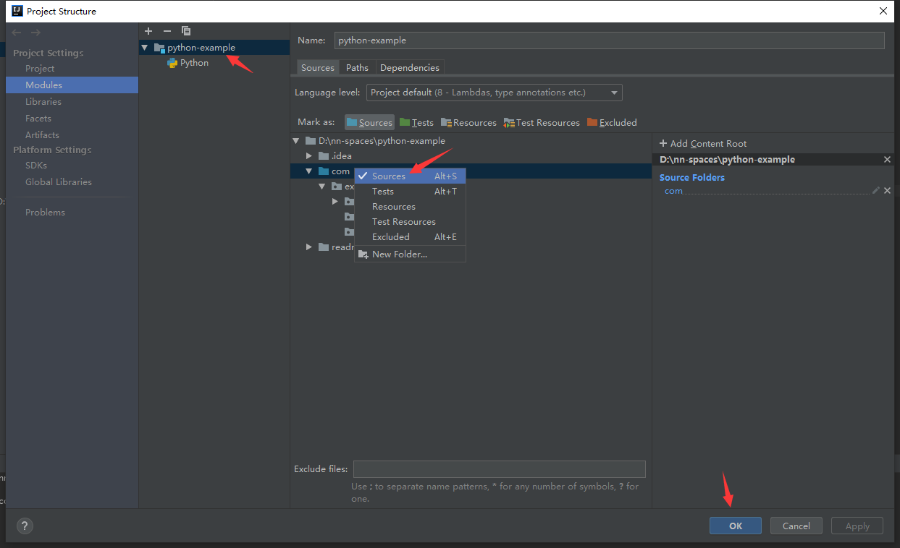

# error
    TabError: inconsistent use of tabs and spaces in indentation
        taberror：inconsistent使用标签和在空间中的压痕 缩进问题
    IndentationError: expected an indented block
        缩进错误：需要缩进块
    SyntaxError: invalid syntax
        语法错误：无效语法
    PEP 8: blank line at end of file
        格式化即可解决
# Unresolved reference 'xxx' more... (Ctrl+F1)
    完整错误：
        Unresolved reference 'begin_fill' less... (Ctrl+F1) 
        Inspection info: 
            This inspection detects names that should resolve but don't. Due to dynamic dispatch and duck typing, 
            this is possible in a limited but useful number of cases. 
            Top-level and class-level items are supported better than instance items.
    *.py代码出现这个错误
        Unresolved reference 'xxx' more... (Ctrl+F1)
    原因：
        这个是关于在 pycharm中无法完成python 模块的导入出现的。
    解决办法：
        方法一：
            file–>setting–>project:server–>project structure
            将放package的文件夹设置为source，这样import的模块类等，就是通过这些source文件夹作为根路径来查找，也就是在这些source文件夹中查找import的东西。 
                IDEA
                    File
                        Project Structure...
                            Module
                                ...
                看图

        
                然后清除缓存并重启
                    IDEA
                        Invalidate Caches / Restart...
            即可。
        方法二：
            清除缓存并重启
                IDEA
                    Invalidate Caches / Restart...
            设置源目录（注意设置的是哪个目录)
                在源目录上右键
                    Mark Directory As
                        Sourcees Root
            即可解决
        
    总结：
        1，设置源目录Sourcees Root
            file–>setting–>project:server–>project structure
            
            or
            
            在源目录上右键
                Mark Directory As
                    Sourcees Root 
        2，清楚缓存并重启
            IDEA
                Invalidate Caches / Restart...
# TypeError: dump() missing 1 required positional argument: 'fp'
    Traceback (most recent call last):
      File "D:/python/learning/ask/1/post2.py", line 8, in <module>
        response = requests.post(url, data=json.dump(payload))
    TypeError: dump() missing 1 required positional argument: 'fp'
    
    解决办法：
        将json.dump()替换为json.dumps()。
    参考资料：
        url
            dump() missing 1 required positional argument: 'fp' in python json [duplicate]